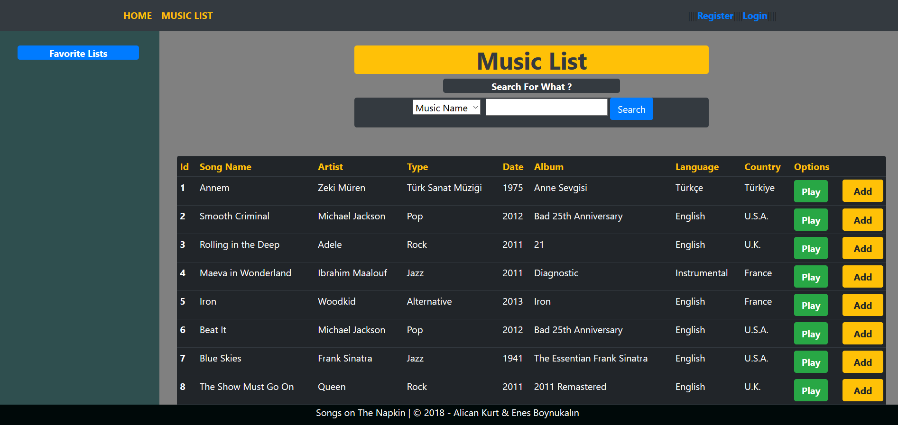
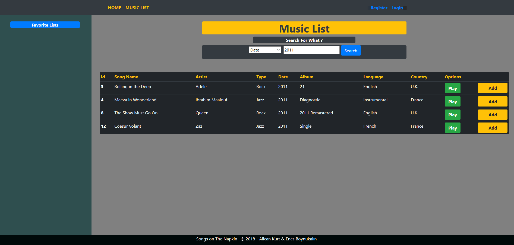
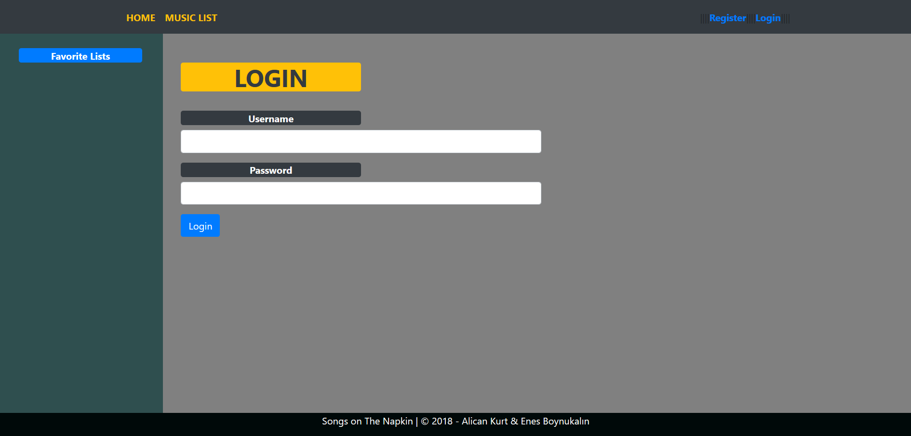
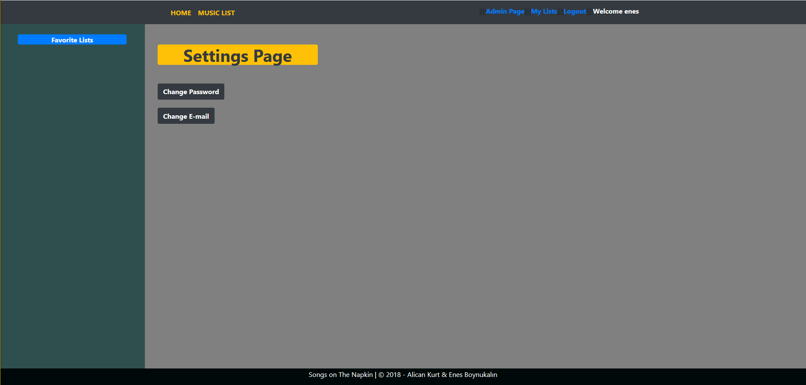
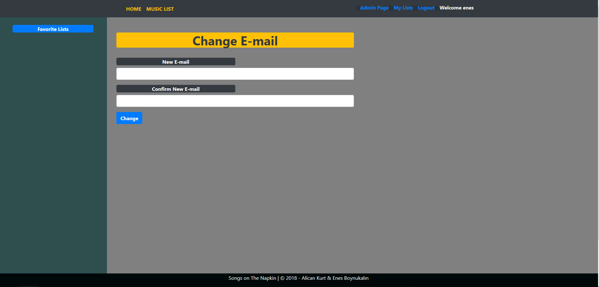
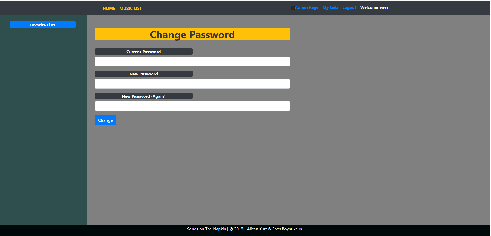
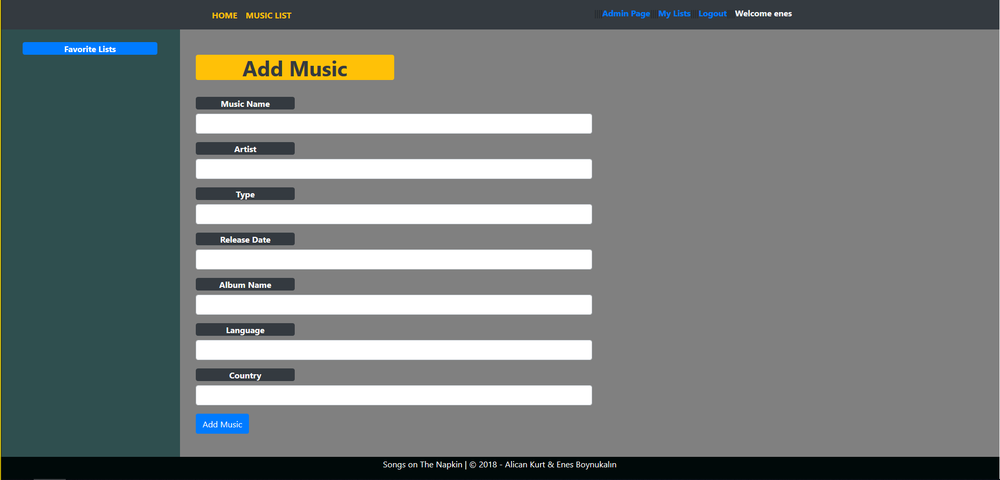
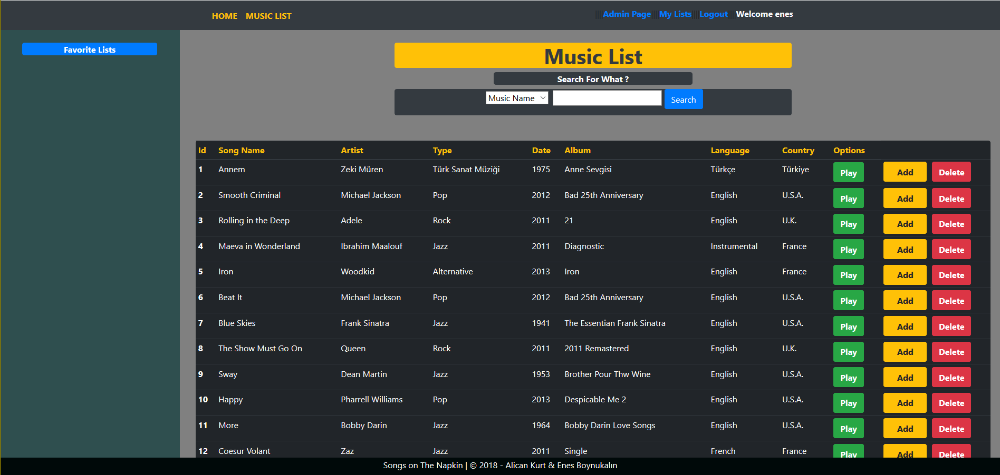

Parts Implemented by Enes Boynukalın
======================================

Home Page
---------------
.. figure:: screenshots/1Homepage.png
      
      The homepage of the site is simple. From this page, register, login and Music can be listed. According to the process, the upper navbar varies.

Show Music Database
--------------------

      Click on ”MUSIC LIST“ from the navbar. All music is available here. It cannot be played without login and cannot be added. Gives the necessary errors.

Search the Music Database
--------------------------

      Desired search can be made according to the desired category. Users do not have to write exactly what to look for. Filtering is done according to the writing. You can search the category by choosing the attribute from the listbox and entering the search query to the textbox.

Login Page
---------------

      After registering, the user can login by filling out the user name and password fields. If the password or username is incorrect, an error is issued. When the entry is successful, navbar becomes user-specific.

Register Page
---------------

.. figure:: screenshots/5Register.png

  Users who want to become a member should click register from the navbar. They must fill in the desired areas as required. For example, if an E-mail has already been received in the E-mail field, a flash message will be sent to the E-mail message. The same applies to username. If the fields in the Password fields do not match, they will also fail with the flash message. If the information is valid in the validator, the user will register successfully and will be redirected to the Login page.

Settings Page
---------------

  After logging in, there are some changes in the navbar. One of these changes is to redirect to Settings page when the user name is clicked above. On this page, the user can change his / her password and E-mail according to some conditions.

Change Email
---------------

  The E-mail update page will be updated as a result of the e-mail address of the user. If the E-mails in two boxes do not match, flash message is given.

Change Password
---------------

  The user must enter the current password and enter the new password in the password change page. If there is an error in any of the user gets error.

Admin Page
---------------

.. figure:: screenshots/13AdminPage.png

  When the admin users (Alican - Enes) are logged in, the Admin Page (appears in the navbar unlike the normal users. When you go to this page, there are two options: add music and delete music. Only users with the authority of the admin can do this process.

Add Music to the Database
---------------------------

  When logged in by admin, they can fill in the necessary places and add music. Two identical songs cannot be added and warning will appear. Fields cannot be blank.

Delete Music from the Database
-------------------------------

  This can be done by admin. Only the admin can see the DELETE button. When the GET command is executed, a flash message is given a warning and gives the error that the person is not admin. 
