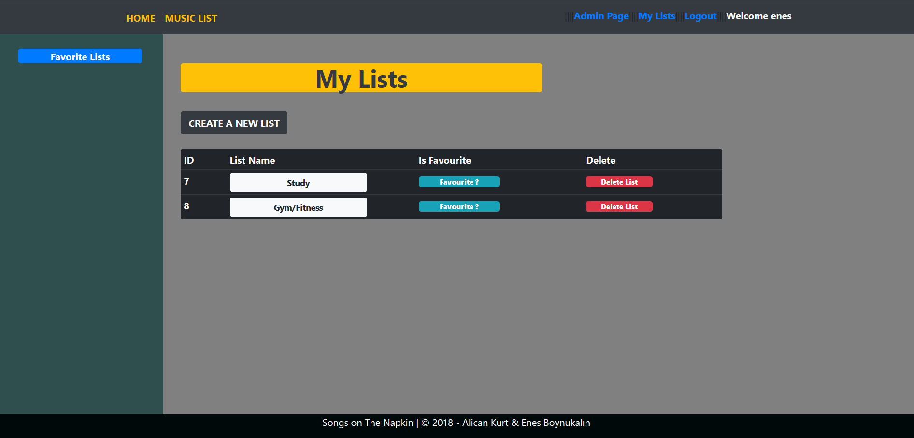
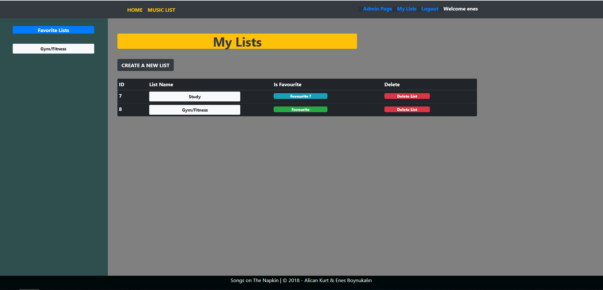
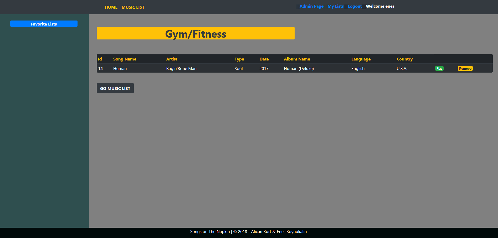
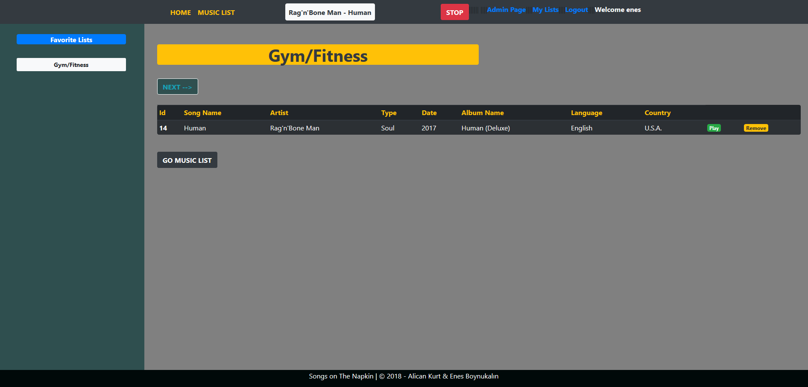
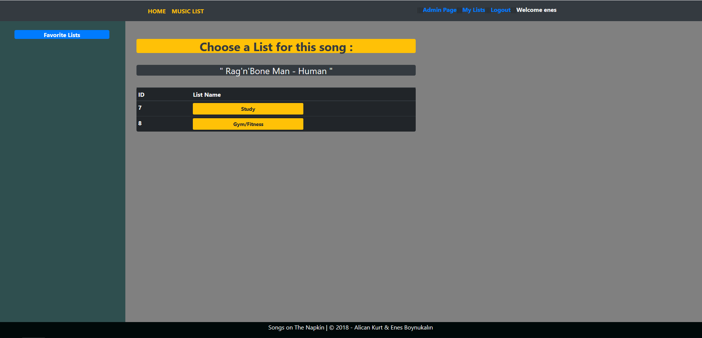
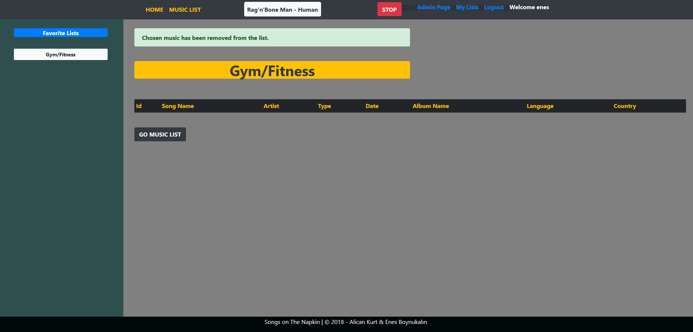

Parts Implemented by Alican Kurt
====================================

Show Users Playlists
----------------------

      
      When the user logs in, there is a link to the My Lists page. Clicking this link goes to the List page. Lists created on this page are displayed and a new list can be created.

Choose which Playlists to be Favourite
----------------------------------------

      The Favorite option appears next to the created lists. Clicking this option makes it a favorite and shows them in the left panel for quick access. If pressed again, the list is no longer your favorite.

Show the Musics inside a Playlist
-----------------------------------

  When the user enters any of the created lists, the songs that he has added to the list are displayed. Can optionally play, move to the next song, or remove the song from the list. This page has a shortcut to the music list.

Play/Next/Stop Music
---------------------

      When the user presses the play button that appears on the right side of the songs in the list, it starts to play the song and shows which song is playing. You can stop the song from the stop button or switch to the next song in the list with the next button.

Add Music to chosen Playlist
-------------------------------

  When the user wants to add music to a playlist he / she has created, he / she will press the add button on the playlist page next to a music and is asked which list to add this song to.If successful, the selected song is added from this page to the selected list.

Remove Music from Users Playlist
---------------------------------

      The songs in playlists page can be removed from the playlist and it gives the user a message that the song has been successfully removed from the list.

